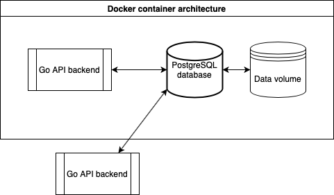

# CRM API test for The Agile Monkeys


This repo contains my proposed solution to **API Test - The CRM Service** by **The Agile Monkeys**. It is written in **Go**.

## App features

### Architecture

The solution proposed makes use of a [PostgreSQL database](https://www.postgresql.org) provided by [its Docker image](https://hub.docker.com/_/postgres/), as part of a multi-container application managed with Docker Compose. The database feeds the API backend service, coded in Go, that is also enabled to run as a Docker container built from [its official image](https://hub.docker.com/_/golang/).

This configuration makes possible to setup the whole architecture with one command, provided Docker is installed, executed from the project's root directory:

```sh
docker-compose up -d --build
```

Where the option `-d` makes `docker-compose` run in detached mode and `--build` rebuilds the Go backend in case changes were made since the last setup.

To shutdown the whole architecture, a similar command needs to be used from the project's root directory:

```
docker-compose down
```

This will stop all the containers but won't remove the volumes defined for them. Thus, the database contents will be persisted in its volume for the next time it is run.



As the above diagram suggest, it is possible to run other backends external to the Docker container architecture, provided the different configuration parameters needed (backend port, database host and ports...) are taken into account.

A stand-alone version of the backend is also running on [Heroku](https://www.heroku.com/), hooked to the GitHub repository's `heroku` branch and using the PostgreSQL database available in the SaaS platform's free tier. As long as authentication is not activated, you can make requests to the available endpoints (see [below](#API_endpoints)) at host [`https://theam-crm-api.herokuapp.com/`](https://theam-crm-api.herokuapp.com/).

The following libraries were used for the backend development:
- `gorilla/mux`: Provides the route handling via its HTTP request multiplexer.
- `lib/pq`: Go database driver for PostgreSQL.
- `crypto/bcrypt`: Cryptographic library for hashing and comparing passwords.
- `dgrijalva/jwt-go`: Go implementation of JSON Web Tokens (JWT)

## <a name="API_endpoints"></a>API endpoints

The API was implemented making use of `gorilla/mux`'s router, which allow matches incoming requests against a list of registered routes and calls a handler for the route that matches the URL or other conditions. All API endpoints return a JSON object, the details below define its content for each endpoint.

For detailing the possible request inputs, conditions and outputs of the API endpoints, the following syntax is used:

```
(<condition?) <input?> -> <response>
```

For the HTTP requests, if any URL segment is a parameter, it will be enclosed in curly braces, `{variable}`, in the title and represented as `variable` in the example responses. For the example JSON responses, only descriptive values are used. No numeric value can be below `1`.

### Customers

#### `GET /customers/all`
Endpoint for getting a list of all customers in the system.
```js
(No customers) -> []
(1+ customers) -> [
    {
        "id":1,
        "name":"Customer_1_name",
        "surname":"Customer_1_surname",
        "picturePath":"/path/to/picture.ext",
        "createdBy":"creatorUser",
        "lastModifiedByUser":"modificatorUser"
    },
    // ... (If more than 1 customer)
]
(Error) -> {"error": "error_message"}
```

<!-- #### Possible endpoint improvements
// TODO -->


#### `GET /customers/{customerId}`
Endpoint for getting the customer of a specific `customerId`.
```js
(Existing customerId) -> {
        "id":customerId,
        "name":"Customer_1_name",
        "surname":"Customer_1_surname",
        "picturePath":"/path/to/picture.ext",
        "createdBy":"creatorUser",
        "lastModifiedByUser":"modificatorUser"
}
(No customers) -> {"error":"Customer not found"}
(Error) -> {"error":"error_message"}
```


#### `POST /customers/create`
Endpoint for creating a specific user in the system. This relies on having uploaded an image first (or not at all, in that case the `"pictureId"` field can be omitted) so the path is shown in the result.
```js
(Created successfully) {
        "name":"Customer_1_name",
        "surname":"Customer_1_surname",
        "pictureId":pictureId, // Or omitted
} -> {
        "id":2,
        "name":"Customer_2_name",
        "surname":"Customer_2_surname",
        "picturePath":"/path/to/picture.ext",
        "createdBy":"creatorUser",
        "lastModifiedByUser":"creatorUser"
}
(Error) * -> {"error":"error_message"}
```

#### `PUT /customers/{customerId}`
Endpoint for updating a specific user in the system. This relies on having uploaded an image first (or not at all, in that case the `"pictureId"` field can be omitted) so the path is shown in the result.
```js
(Updated successfully) {
        "name":"Updated_customer_1_name",
        "surname":"Updated_customer_1_surname",
        "pictureId":pictureId, // Or omitted
} -> {
        "id":customerId,
        "name":"Updated_customer_1_name",
        "surname":"Updated_customer_1_surname",
        "picturePath":"/path/to/picture.ext",
        "createdBy":"creatorUser",
        "lastModifiedByUser":"userWhoMadeTheRequest"
}
(Nonexistent {customerId}) * -> {"error":"No customer was updated"}
(Error) * -> {"error":"error_message"}
```

#### `DELETE /customers/{customerId}`
Endpoint for deleting a specific user in the system.
```js
(Deleted successfully) * -> {"result":"success"}
(Nonexistent {customerId}) * -> {"error":"No customer was deleted"}
(Error) * -> {"error":"error_message"}
```

### Pictures

#### `GET /customers/picture/{pictureId}`
Endpoint for getting the picture path of a specific `pictureId`.
```js
(Existing pictureId) -> {
        "id":pictureId,
        "picturePath":"picture/id/path",
}
(No picture) -> {"error":"Picture not found"}
(Error) -> {"error":"error_message"}
```

#### `POST /customers/picture/upload`
Endpoint for uploading picture to the system.
```js
(Uploaded and stored successfully) [image_multipart_form] -> {
        "id":1,
        "picturePath":"picture/id/path.ext",
}
(Error) * -> {"error":"error_message"}
```

### User authentication and authorization
The whole `/customer` endpoints are behind an authentication middleware that uses JWT. To be able to make requests to these endpoints, you must set the `Authorization` header to `"Bearer {token}"`, where `{token}` is the value of the field with the same name on a successful response to `/users/login` (see below). Otherwise, all responses will be `Unauthorized` (or `Bad request` if the request payload is malformed) with their corresponding HTTP codes.

#### `POST /users/register`
Endpoint for registering a new user. The `"username"` values must be unique
```js
(Valid user) {
        "username":"userName",
        "password":"password",
} -> {"result": "success"}
(Password less than 12 characters) -> {"error": "Password less than 12 characters"}
(Error) * -> {"error":"error_message"}
```

#### `POST /users/login`
Endpoint for user login and session token retrieval. The token has a expiration time set to 5 minutes.
```js
(Valid user) {
        "username":"userName",
        "password":"password",
} -> {"result": "success", "token": tokenString}
(Error verificating user) -> {"error": "Invalid credentials"}
(Error) * -> {"error":"error_message"}
```


## Further improvements

### Database pre-populating
At this moment, the database table creation and pre-populating with a placeholder image path and an administrator user is done at `db/db.go`, being part of the backend execution. This is should be done somewhere else, be it mouting a directory with the `sql` files to `/docker-entrypoint-initdb.d/` at the PostgreSQL Docker image, which initializes it if the database is empty, or using other environment-specific methods available.

### Better error handling
At this moment many of the errors that can occur are simply printed to the standard logger (stoppping the erroring operation where it makes sense, of course) and in case it's needed they are used as a response to API requests. This needs some polish.

### More testing
At the time of writing this there is a _E2E_ or system test at `main_test.go` that uses the whole API in different situations (authenticated, not authenticated, invalid customers and users, etc). It's not fully exhaustive, but it tests every endpoint. There are not unit tests yet. It's good practice to include unit tests for every function in each of the individual packages, and I'll try to add them soon.

### ... and much more!
I mean, this is being done in less than a week, while working full time and with a world-spanning viral crisis in full force! Sure there is room for improvement :)
